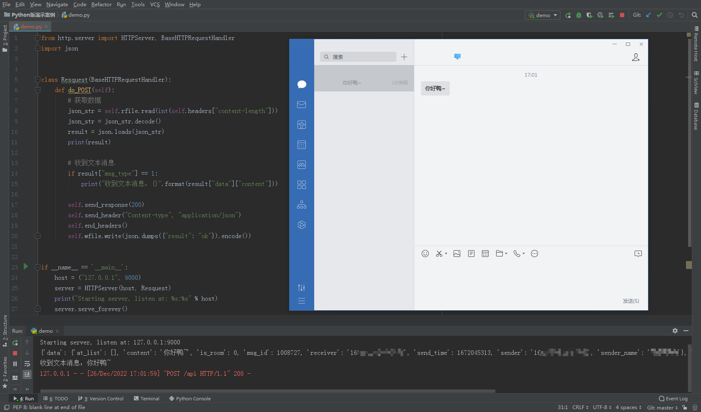
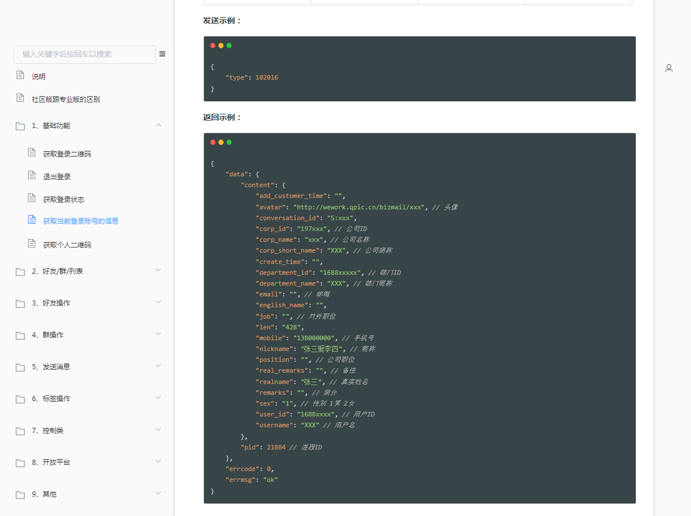
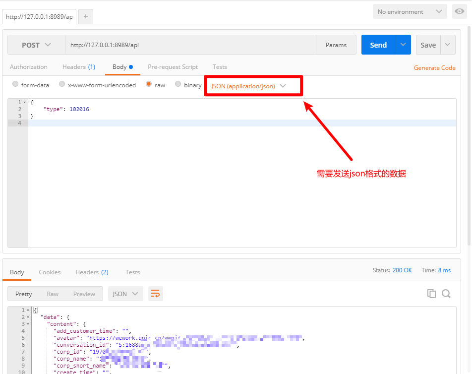

# vworkApi介绍

《vworkApi》是基于PC端的企业微信封装的、REST风格的接口，开发者可通过**HTTP轻松调用**，真正实现“跨语言”操作！

### 社区版跟专业版的区别？

- 社区版：
  - 麻雀虽小五脏俱全！
  - 不支持长时间运行
- 专业版：
  - 功能更加强大、稳定！
  - 支持长时间运行

> 如果对你有帮助，别吝啬你的小手留个star呗

## 使用教程（仅需3步）

> 使用前请先安装指定版本的微信
>
> 指定版本微信安装包：[https://pan.baidu.com/s/1FKlfwVsFLOhAKYlpSWSSMA](https://pan.baidu.com/s/1FKlfwVsFLOhAKYlpSWSSMA)
>
> 提取码：sszs

- 克隆该项目（请关闭你的杀毒软件，否则可能会误删dll文件）

1. 开启一个http服务，并且运行在 `9000` 端口上，请求路径为 `/msg`
2. 运行《注入工具(图形界面版).exe》点击启动并注入
3. 注入成功后，即可向 `8989` 端口发送http请求，执行对应操作，请求路径为 `/api`

> 如需多开并自定义端口号，命令行调用《inject_tool.exe》即可
>
> 启动命令：[exe的全路径] start [要开启的端口号]

## 疑问解答、联系方式

- 交流QQ群：716983832
- 进群解决一切蛇皮问题！

## help(vworkApi)

**1、监听消息**

**2、发送指令**

## 声明

**本项目仅供技术研究，请勿用于非法用途，如有任何人凭此做何非法事情，均于作者无关，特此声明。**

